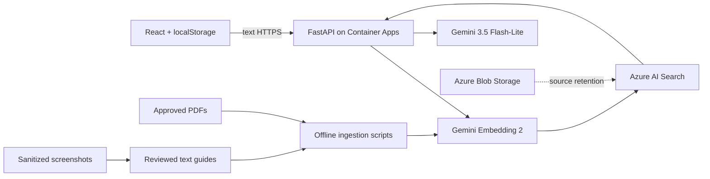

# Sri Lanka Tax Assistant

A web assistant for Sri Lankan tax questions and Sri Lankan tax-portal navigation. With Azure AI Search configured, it uses retrieval-augmented generation (RAG) over Sri Lankan Documents and the RAMIS documentation and exposes the sources used. The entire project is designed to run under the free tier of Azure. But high usage might incur some costs.

The project is accessible at: https://victorious-pebble-089e90700.7.azurestaticapps.net/


## 1. Problem Statement

General-purpose chatbots can mix jurisdictions, use outdated rules, and invent plausible-looking rates, deadlines, or legal citations. They also do not know context-specific portal workflows. This project constrains generation to curated Sri Lankan legislation, notices, guides, and human-reviewed text portal guides.

The assistant provides informational guidance, not professional tax advice. Users should verify important decisions with official Sri Lankan sources or a qualified professional.

## 2. Use Case

The application is intended for taxpayers, tax practitioners, and other users who need conversational assistance with Sri Lankan taxation or supported Sri Lankan tax-portal workflows.

Users can:

- ask natural-language questions about Sri Lankan taxation;
- ask how to navigate supported workflows in the Sri Lankan tax portal;
- view relevant public images included by the assistant from retrieved sources;
- continue a conversation with a bounded recent history;
- inspect and open citations returned with an answer; and
- keep multiple conversations locally without creating an account.

The runtime accepts text only. It does not accept or inspect files, screenshots, images, audio, or video. Assistant responses can display a public image referenced by retrieved evidence.

## 3. Solution Overview

The React frontend sends the user's latest question and recent conversation history to a FastAPI backend. Using Azure AI Search, the backend embeds the question, performs hybrid keyword/vector retrieval, and supplies relevant approved chunks to Gemini as untrusted evidence with stable source markers. Gemini determines the request scope and whether the evidence is sufficient. Only marker IDs present in the retrieved evidence can become response citations.

The Gemini model used is Gemini-3.5 Flash-Lite to keep the cost low. The embedding model is gemini-embedding-2

Chat data is not stored in an application database; conversations remain in the browser's `localStorage`.

## 4. Dataset

The dataset was created by using multiple deep research sessions to extract public Sri Lankan tax information. The guides only included official documents from the IRD and other government organizations. The source registry is stored in `data/metadata/`. Downloaded documents and generated corpus artifacts remain local and are excluded from Git.


The full registry, corpus-build, search-index rollout, guide-image workflow, and rollback procedure are documented in [setup_data_indicies.md](setup_data_indicies.md). The initial evaluation set in [evaluation/rag_questions.json](evaluation/rag_questions.json) contains 20 normal, year-sensitive, portal, foreign, unsupported, and prompt-injection questions. Expected source IDs must be completed after the real corpus is approved.

## 5. AI/ML Approach

The application uses retrieval-augmented generation rather than training a custom model. Its grounded request flow is:

1. A year such as `2025/26` is normalized and used to prioritize or filter applicable metadata.
2. Gemini creates a `RETRIEVAL_QUERY` embedding for the user's latest question.
3. Azure AI Search combines vector similarity with keyword search and an optional year filter across tax documents and portal guides.
4. Chunks below `RAG_MIN_SCORE` are removed and duplicate evidence is collapsed. The default is `0.01` because Azure hybrid/RRF scores are commonly around `0.01-0.03`, rather than normalized similarity scores.
5. Gemini receives recent messages and selected text evidence, then determines request scope and the most suitable answer format.
6. Generated `[SOURCE_n]` markers are mapped to structured citations; unknown markers are dropped.
7. Procedural responses are validated against a structured guide contract. The frontend renders only structured, approved image URLs.

The initial model configuration uses Gemini 3.5 Flash-Lite for generation and Gemini Embedding 2 for vector embeddings. Both model IDs are configurable. The ingestion and query embedding settings, including vector dimensions, must match. `RAG_MIN_SCORE` must be calibrated against the deployed corpus and evaluation set before production use.

## 6. Application Architecture



### Repository structure

```text
frontend/            React application
backend/             FastAPI service, RAG implementation, Dockerfile
scripts/             Search-index creation and offline ingestion
data/metadata/       Corpus manifests and guide-image metadata
data/sample/         Draft portal-guide format (never approved by default)
evaluation/          Initial 20-question RAG evaluation set
infra/terraform/     Azure infrastructure
.github/workflows/   Build and Terraform deployment
```

The API rejects extra fields, non-text content, empty messages, invalid roles, oversized histories, and histories that do not end in a user turn. Application code does not log full prompts or questions. Search documents are treated as untrusted evidence to reduce prompt-injection risk, and the Blob container is private.

## 7. Technology Stack

| Layer | Technology |
|---|---|
| Frontend | React, TypeScript, Vite, Tailwind CSS |
| API | Python, FastAPI, Pydantic |
| Generation | Configurable Gemini model (`gemini-3.5-flash-lite` initially) |
| Embeddings | Configurable Gemini embedding model (`gemini-embedding-2` initially) |
| Retrieval | Azure AI Search hybrid vector/keyword search |
| Source retention | Private Azure Blob Storage container |
| Hosting | Azure Static Web Apps and Azure Container Apps Consumption |
| Infrastructure as code | Terraform with AzureRM |
| Container registry | Public GitHub Container Registry (GHCR) recommended |
| Package management | pnpm for the frontend; uv for the backend |

## 8. Local Setup Instructions

### Prerequisites

Install:

- [Git](https://git-scm.com/downloads);
- [Node.js 22](https://nodejs.org/en/download);
- [pnpm](https://pnpm.io/installation);
- Python 3.11 or newer; and
- [uv](https://docs.astral.sh/uv/getting-started/installation/).

Terraform and the Azure CLI are required only for Azure deployment. Confirm the local tools and clone the repository:

```bash
git --version
node --version
pnpm --version
python3 --version
uv --version

git clone <repository-url>
cd <repository-directory>
```

A Gemini API key is required to send chat requests. Azure AI Search is optional for local development; without it, the backend uses Gemini without retrieval or citations.

### Backend

```bash
cd backend
uv sync --dev
cp .env.example .env
uv run uvicorn app.main:app --reload --port 8000
```

Add `GEMINI_API_KEY` to `backend/.env` to enable chat. Add both `AZURE_SEARCH_ENDPOINT` and `AZURE_SEARCH_KEY` to enable grounded RAG responses. `GET http://localhost:8000/api/health` works without provider credentials.

Run the backend linter from `backend/`:

```bash
uv run ruff check .
```

### Frontend

In a second terminal:

```bash
cd frontend
pnpm install
cp .env.example .env
pnpm dev
```

Open `http://localhost:5173`. Create a production build with:

```bash
pnpm build
```

## 9. Deployment Details

The target cloud platform is Microsoft Azure. Terraform provisions:

- a resource group;
- a Free Azure Static Web App for the frontend;
- a private LRS Storage Account and Blob container;
- a Free Azure AI Search service;
- a Log Analytics workspace;
- a Container Apps environment; and
- an externally accessible, scale-to-zero FastAPI Container App.

Complete [azure_setup.md](azure_setup.md) before deploying. It explains how to select an Azure subscription, create the resource groups and Terraform state storage, create the Microsoft Entra application and service principal, configure GitHub OIDC, grant scoped roles, and add the required GitHub secrets and variables.

After the one-time setup, deployment follows this sequence:

1. Commit the changes and push them to `main`.
2. The GitHub Actions workflow builds and publishes the backend image.
3. Terraform provisions or updates the Azure resources.
4. The workflow creates the Search index, builds the frontend with the deployed backend URL, and deploys the frontend.
5. Approved Sri Lankan sources are uploaded and ingested.
6. Grounded answers, refusal behavior, and low-evidence behavior are verified against the deployed corpus.


## 10. API/Web Application Usage

### Web application

Open the deployed frontend URL, or `http://localhost:5173` during local development. Start a conversation from the sidebar, enter a Sri Lankan tax or supported portal-navigation question, and submit it. Grounded responses display citations that can be opened for source inspection. Structured portal guides may include approved images retrieved with the supporting evidence.

Conversations are saved only in the current browser's `localStorage`. There is no authentication, user database, server-side session storage, portal automation, or open web search.

### API

Check service health:

```bash
curl http://localhost:8000/api/health
```

Send a chat request:

```bash
curl -X POST http://localhost:8000/api/chat \
  -H 'Content-Type: application/json' \
  -d '{"messages":[{"role":"user","content":"What do the approved sources say about VAT?"}]}'
```

Successful responses contain `answer`, `citations`, and an optional structured `guide`. A guide contains ordered steps, and each step can reference only an approved, retrieved image through its structured `image` field. Clients should ignore unknown fields so older saved conversations remain readable. Errors use a stable `{ "error": { "code", "message" } }` shape and do not expose provider internals.

When Gemini returns HTTP 429 after exhausting a request, token, or daily quota, the API returns `GEMINI_USAGE_LIMIT` with a user-facing message asking the user to try again later.

## 11. Docker Instructions

Build the non-root backend image from the repository root:

```bash
docker build -t sri-lanka-tax-assistant-api ./backend
```

Run it with the backend environment file:

```bash
docker run --rm -p 8000:8000 --env-file backend/.env sri-lanka-tax-assistant-api
```

Verify the container at `http://localhost:8000/api/health`. For deployment, publish an image such as `ghcr.io/<user>/<repo>-api:<tag>` and pass it to Terraform as `container_image`. Never bake `.env` files or secrets into the image.
