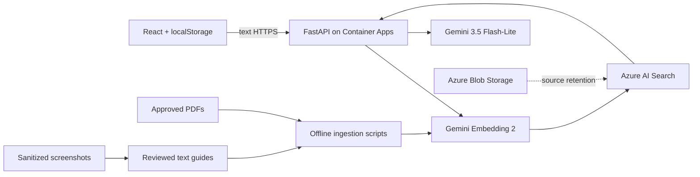

# Sri Lanka Tax Assistant

A web assistant for Sri Lankan tax questions and Sri Lankan tax-portal navigation. With Azure AI Search configured it uses retrieval-augmented generation over an approved corpus and exposes the sources used. It can also run in an ungrounded Gemini-only mode for local testing.

> Status: the application, provider integrations, ingestion pipeline, Docker image, and Terraform infrastructure are scaffolded. A grounded deployment needs approved source documents plus Gemini and Azure credentials; sample metadata is deliberately not tax content.

## Problem statement

General-purpose chatbots can mix jurisdictions, use outdated rules, and invent plausible-looking rates, deadlines, or legal citations. They also do not know project-specific portal workflows. This project constrains generation to curated Sri Lankan legislation, notices, guides, and human-reviewed text portal guides.

The assistant provides informational guidance, not professional tax advice. Users should verify important decisions with official Sri Lankan sources or a qualified professional.

## Use case and scope

- Ask natural-language questions about Sri Lankan taxation.
- Ask how to navigate supported workflows in the Sri Lankan tax portal.
- View relevant public images included by the assistant from retrieved sources.
- Continue a conversation with a bounded recent history.
- Inspect and open citations returned with an answer.
- Keep multiple conversations locally without an account.

The runtime does not accept or inspect files, screenshots, images, audio, or video. Assistant responses can display a public image referenced by retrieved evidence. Development screenshots must first be sanitized, converted to text, reviewed, and approved. The model decides whether to refuse foreign tax questions and unrelated requests.

## Solution overview

The FastAPI service embeds the latest question and runs hybrid keyword/vector retrieval over Azure AI Search. Relevant chunks are provided to Gemini as untrusted evidence with stable source markers. Gemini determines the request scope and whether the evidence is sufficient, including when retrieval returns no chunks. Only marker IDs present in the evidence can become response citations.



Chat data never enters an application database; it stays in browser `localStorage`.

## Technology stack

| Layer | Technology |
|---|---|
| Frontend | React, TypeScript, Vite, Tailwind CSS |
| API | Python, FastAPI, Pydantic |
| Generation | Configurable Gemini model (`gemini-3.5-flash-lite` initially) |
| Embeddings | Configurable Gemini embedding model (`gemini-embedding-2` initially) |
| Retrieval | Azure AI Search hybrid vector/keyword search |
| Source retention | Private Azure Blob Storage container |
| Hosting | Azure Static Web Apps + Azure Container Apps Consumption |
| Infrastructure | Terraform with AzureRM |
| Container registry | Public GHCR recommended |

Model IDs and embedding dimensions are configuration values. Ingestion and query embedding settings must always match.

## Repository map

```text
frontend/            React application
backend/             FastAPI service, RAG implementation, Dockerfile
scripts/             Search-index creation and offline ingestion
data/metadata/       Corpus manifest templates
data/sample/         Draft portal-guide format (never indexed as approved)
evaluation/          Initial 20-question RAG evaluation set
infra/terraform/     Azure infrastructure
.github/workflows/   Build and Terraform deployment
```

## Getting started from a new computer

Install [Git](https://git-scm.com/downloads),
[Node.js 22](https://nodejs.org/en/download),
[pnpm](https://pnpm.io/installation), Python 3.11 or newer, and
[uv](https://docs.astral.sh/uv/getting-started/installation/). Terraform and the
Azure CLI are only required for Azure deployment. Confirm the tools, then clone
the repository:

```bash
git --version
node --version
pnpm --version
python3 --version
uv --version
```

```bash
git clone <repository-url>
cd <repository-directory>
```

You need a Gemini API key to send chat requests. Azure AI Search is optional for
local development; without it, the backend uses Gemini without retrieval or
citations.

## Local setup

### Backend

```bash
cd backend
uv sync --dev
cp .env.example .env
uv run uvicorn app.main:app --reload --port 8000
```

`GET http://localhost:8000/api/health` works without provider credentials. Chat requires `GEMINI_API_KEY`; when the Azure Search endpoint or key is absent, it skips embedding and retrieval and answers from Gemini's model knowledge. This fallback returns no citations and its tax facts may be incomplete or outdated. Set both `AZURE_SEARCH_ENDPOINT` and `AZURE_SEARCH_KEY` to enable grounded RAG responses.

Run the backend linter:

```bash
cd backend
uv run ruff check .
```

### Frontend

```bash
cd frontend
pnpm install
cp .env.example .env
pnpm dev
```

Open `http://localhost:5173`. Create a production build with `pnpm build`.

## API

Health:

```bash
curl http://localhost:8000/api/health
```

Chat:

```bash
curl -X POST http://localhost:8000/api/chat \
  -H 'Content-Type: application/json' \
  -d '{"messages":[{"role":"user","content":"What do the approved sources say about VAT?"}]}'
```

Success responses contain `answer` and `citations`; images are represented in `answer` with Markdown rather than a separate image field. Errors use a stable `{ "error": { "code", "message" } }` shape and do not expose provider internals.

When Gemini returns HTTP 429 after exhausting a request, token, or daily quota, the API
returns `GEMINI_USAGE_LIMIT` with a user-facing message asking the user to try again later.

## Dataset and knowledge ingestion

Only approved sources with `jurisdiction: LK` belong in the production index.

1. Copy [data/metadata/sources.example.yaml](data/metadata/sources.example.yaml) to a private/appropriate manifest and point entries to approved PDFs.
2. Put raw documents under `data/raw/tax-documents/` or another protected location. `data/raw/` is gitignored.
3. Configure `backend/.env` with Gemini and Search values.
4. Create the index and ingest content:

```bash
cd backend
uv run python ../scripts/create_search_index.py
uv run python ../scripts/ingest_tax_documents.py --manifest path/to/sources.yaml
uv run python ../scripts/ingest_portal_guides.py --directory ../data/processed/portal-guides
```

The PDF pipeline preserves page boundaries and manifest dates, creates overlapping chunks, embeds in batches, and upserts stable IDs. It reports indexed, skipped, and failed records.

### Portal screenshot workflow

Screenshots are development inputs only. Remove names, TINs, credentials, tokens, account details, and other confidential data before inspection. Convert each workflow into YAML matching [data/sample/portal-guide.example.yaml](data/sample/portal-guide.example.yaml), manually verify every step, then set `review_status: approved`. The ingestion script rejects drafts and non-LK guides. Images and image paths are never indexed.

## AI/RAG behavior

When Azure AI Search is not configured, the backend bypasses steps 1–4 below and asks
Gemini to answer from model knowledge. This mode is intended for local testing, is not
grounded in the approved corpus, and returns an empty `citations` list.

1. A year such as `2025/26` is normalized and used to prioritize/filter applicable metadata.
2. Gemini creates a `RETRIEVAL_QUERY` vector.
3. Azure AI Search combines that vector with keyword search and an optional year filter across both tax documents and portal guides.
4. Chunks below `RAG_MIN_SCORE` are removed and duplicate evidence is collapsed.
5. Gemini receives recent messages and the selected text evidence, then determines request scope and the most suitable answer format.
6. Generated `[SOURCE_n]` markers are mapped to structured citations; unknown markers are dropped.

The initial evaluation questions in [evaluation/rag_questions.json](evaluation/rag_questions.json) cover normal, year-sensitive, portal, foreign, unsupported, and prompt-injection cases. Expected source IDs should be filled after the real corpus is approved. Calibrate `RAG_MIN_SCORE` against this set rather than treating the default as production-ready.

## Docker

Build and run the non-root backend image:

```bash
docker build -t sri-lanka-tax-assistant-api ./backend
docker run --rm -p 8000:8000 --env-file backend/.env sri-lanka-tax-assistant-api
```

For deployment, publish an image such as `ghcr.io/<user>/<repo>-api:<tag>` and pass it to Terraform as `container_image`. Never bake `.env` or secrets into the image.

## Azure infrastructure with Terraform

Terraform provisions:

- resource group;
- Free Azure Static Web App;
- private LRS Storage Account/container;
- Free Azure AI Search service;
- Log Analytics workspace;
- Container Apps environment;
- externally accessible, scale-to-zero FastAPI Container App.

### One-time Azure and GitHub setup

Follow [azure_setup.md](azure_setup.md) from the beginning. It explains how to
select an Azure subscription, create both resource groups and the Terraform
state storage, create the Entra application and service principal, configure
GitHub OIDC, grant the two scoped roles, and add all GitHub secrets and
variables. It does not assume that any project resource or deployment identity
already exists.

After that setup, a push to `main` runs the end-to-end deployment. The workflow
builds the backend image, applies Terraform, creates the Search index, builds
the frontend with the deployed backend URL, and deploys the frontend. No
bootstrap shell script is needed.

Do not commit `terraform.tfvars`, `.tfstate`, API keys, or Azure credentials.
Terraform state can contain sensitive values and is stored in the private
remote backend created by the setup guide.

The search schema and data are managed idempotently by Python rather than Terraform.

Useful outputs include the frontend URL, backend URL, storage account name, and Search service name. Build the frontend with `VITE_API_BASE_URL` set to the backend output, then deploy `frontend/dist` to the Static Web App.

## Deployment sequence

1. Complete [azure_setup.md](azure_setup.md), including the GitHub secrets and repository variable.
2. Commit your changes and push them to `main`.
3. The deployment workflow builds, provisions, and deploys the application.
4. Upload/ingest only approved Sri Lankan sources for grounded answers.
5. Verify grounded answers, refusal behavior, and low-evidence behavior against that corpus.

Pull requests never deploy. Main deployments are serialized so two Terraform
applies cannot race for the state lock.

## Security and privacy

- Secrets are backend-only environment values and are excluded from Git.
- CORS is explicit; production allows only the configured frontend origin.
- The API rejects extra fields, non-text content, empty messages, invalid roles, oversized histories, and histories not ending in a user turn.
- Full prompts/questions are not logged by application code.
- Search documents are treated as untrusted evidence to reduce prompt-injection risk.
- The Blob container is private; raw screenshots are gitignored and excluded from runtime.
- There is no authentication, user database, server-side session storage, portal automation, or open web search.

## Known limitations

- No authoritative corpus is distributed with this repository yet, so real tax answers require a separately approved dataset.
- Gemini-only answers are ungrounded and may be incomplete or outdated; use RAG and official sources for decisions that require accuracy.
- Model-based scope decisions require evaluation against Sri Lankan terminology, foreign-tax questions, unrelated requests, and prompt injection.
- `RAG_MIN_SCORE` requires corpus-specific calibration.
- PDF extraction does not perform OCR and may need document-specific header/footer cleanup.
- Citation markers unsupported by retrieved evidence are removed, but generated prose still requires groundedness evaluation.
- Portal wording may change; each guide needs a version and periodic human review.
- English is the only initial language.
- Deployment is not complete until real Azure/Gemini credentials, GHCR image, corpus, and Static Web Apps deployment are supplied.

## Cost controls

The design uses Free Azure Search and Static Web Apps tiers, Container Apps Consumption with zero minimum replicas, a small API container, private LRS Blob storage, bounded RAG context, browser-only sessions, and no database. Availability of Free SKUs varies by subscription and region; inspect the Terraform plan before applying.
